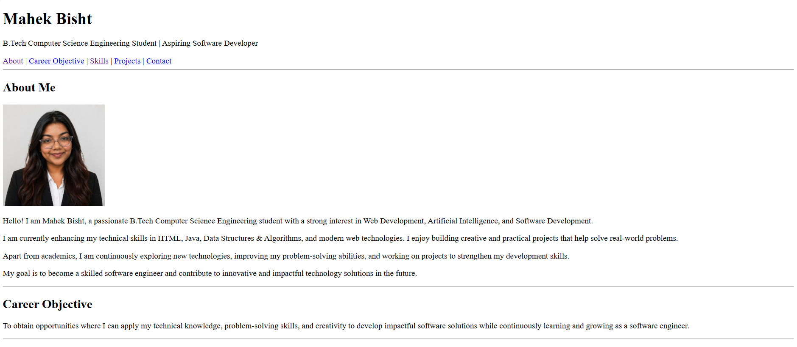
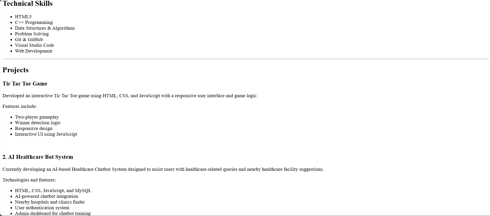
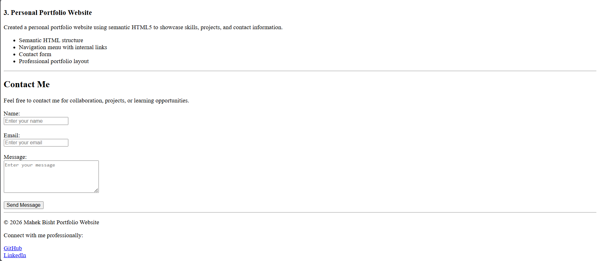

# Personal Portfolio Website

## Project Overview
This project is a professional personal portfolio website created using HTML5.
The portfolio showcases personal information, technical skills, projects,
career objectives, and contact details in a structured format.

The purpose of this project is to practice basic web development concepts
and create a beginner-friendly professional portfolio website.

---

## Technologies Used
- HTML5
- Visual Studio Code (VS Code)

---

## Features
- Semantic HTML5 structure
- Navigation menu with internal links
- About Me section
- Career Objective section
- Technical Skills section
- Projects section
- Contact form with validation attributes
- Profile image with alt text
- Footer with professional links

---

## Folder Structure

portfolio-website/
│
├── index.html
├── README.md
├── requirements.txt
│
└── images/
    ├── profile.jpg
    ├── contact.png
    ├── homepage.png
    └── skills.png

--- 

## How to Run the Project

1. Download or clone the repository
2. Open the project folder in VS Code
3. Open `index.html` in any web browser

---

## HTML Concepts Learned
- HTML document structure
- Semantic HTML tags
- Headings and paragraphs
- Lists in HTML
- Internal navigation links
- Forms and input fields
- Images and alt attributes
- Footer and section organization

---

## Future Improvements
- Add CSS styling for modern UI
- Make website responsive
- Add JavaScript functionality
- Improve animations and design

---

## Screenshots

### Homepage

### Skills Section

### Contact Section

---
## Author
**Mahek Bisht**  
B.Tech Computer Science Engineering Student