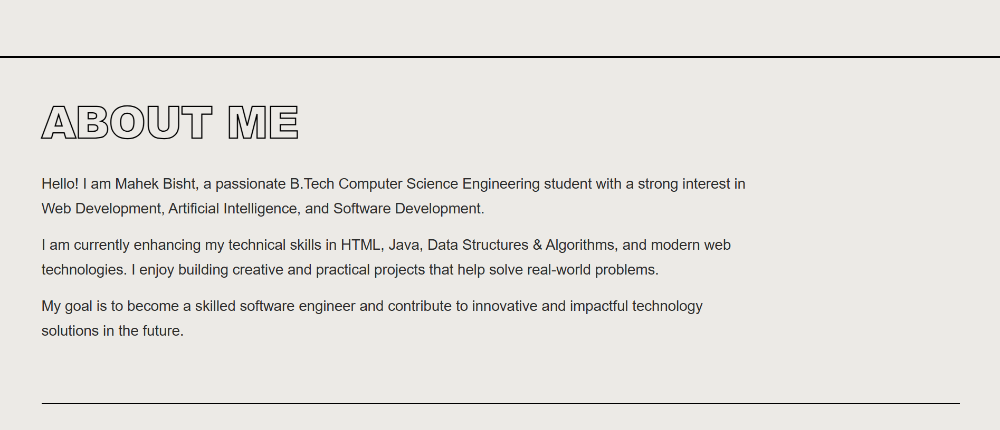
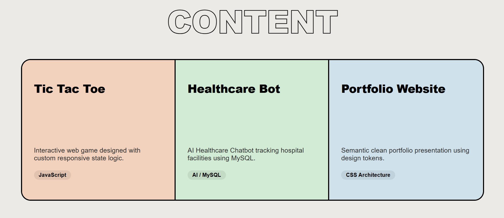
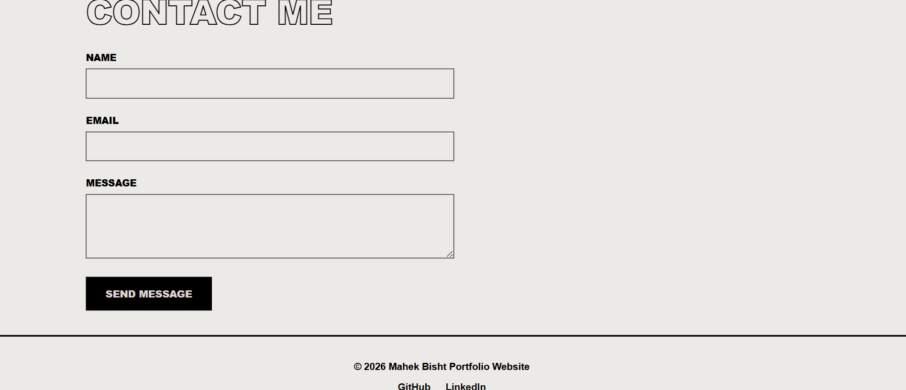
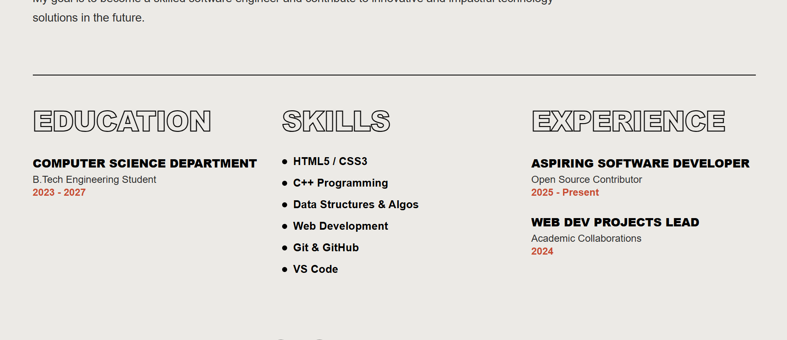

# Personal Portfolio Website

## Project Overview
This project is a modern and responsive personal portfolio website created using HTML5 and CSS3.  
The portfolio showcases personal information, technical skills, education, projects, and contact details in a professional and visually appealing format.

The purpose of this project is to practice frontend web development concepts such as semantic HTML structure, CSS styling, responsive layouts, hover effects, Flexbox, and Grid systems.

---

## Technologies Used
- HTML5
- CSS3
- Visual Studio Code (VS Code)
- GitHub

---

## Features
- Semantic HTML5 structure
- Responsive web design
- External CSS styling
- Navigation menu with internal links
- Modern hero section
- About Me section
- Skills and education section
- Project showcase cards
- Hover effects and transitions
- Contact form with validation
- Responsive Grid and Flexbox layout
- Professional footer section

---

## Folder Structure

portfolio-website/
│
├── index.html
├── style.css
├── README.md
├── requirements.txt
│
├── images/
│   └── profile.jpg
│
└── screenshots/
    ├── homepage.png
    ├── about-section.png
    ├── projects-section.png
    └── contact-section.png
    └── education.png
---

## How to Run the Project

1. Download or clone the repository
2. Open the project folder in VS Code
3. Open `index.html` in any web browser

---

## CSS Concepts Implemented
- CSS Variables
- Flexbox Layout
- CSS Grid Layout
- Hover Effects
- Media Queries
- Responsive Design
- Typography Styling
- Custom Color Palette
- Box Model
- CSS Selectors

---

## Technical Requirements Completed

### External CSS File
A separate `style.css` file was created and linked to the HTML document.

### CSS Selectors
Different CSS selectors were used including:
- Element selectors
- Class selectors
- Hover pseudo-class selectors

### Hover Effects
Hover effects were added on:
- Navigation links
- Buttons
- Project cards
- Profile image

### Responsive Design
Media queries were implemented for mobile responsiveness.

### Flexbox and Grid
Both Flexbox and CSS Grid were used for layouts and section alignment.

### Custom Fonts and Colors
A custom color palette and typography styling were implemented using CSS variables.

---

## Screenshots

### Homepage

### About Section

### Projects Section

### Contact Section

### Education Section

---

## Future Improvements
- Add JavaScript functionality
- Add animations and transitions
- Make contact form functional
- Add dark/light mode
- Deploy portfolio website online

---

## Author
**Mahek Bisht**  
B.Tech Computer Science Engineering Student